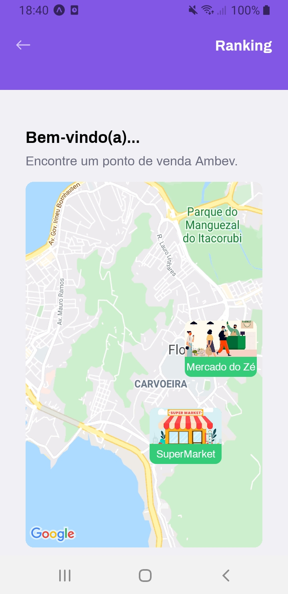
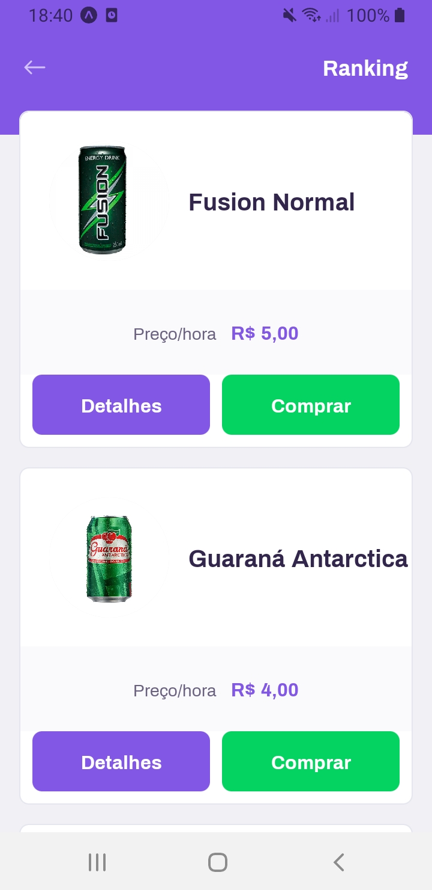
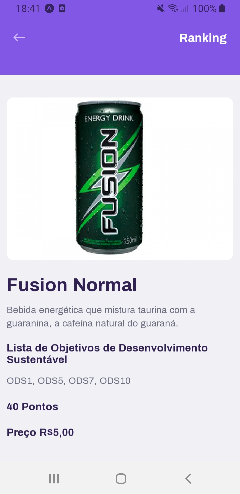
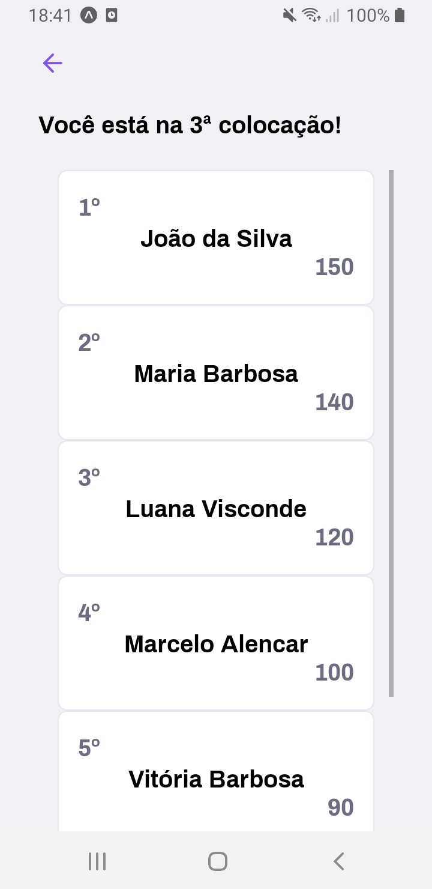

## Project built during Ambev Innovation Game II

O PlanetAmbev é um app que gera rankings de compra de produtos do segmento de bebidas não alcoólicas a partir do sistema ODSpoints. O sistema de ODSpoints tem o objetivo distribuir pontos aos clientes que compram produtos Ambev que respeitam os Objetivos de Desenvolvimento Sustentável. O app PlanetAmbev foi desenvolvido na linguagem Javascript, utilizando o framework React Native em conjunto com o superset Typescript  para fazer o front-end.

### Mobile

  

  

  

  

